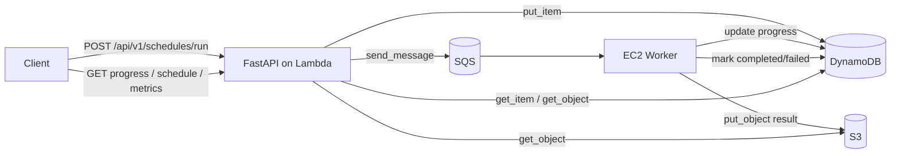

# Kiến Trúc Triển Khai

Tài liệu ngắn gọn mô tả cách hệ thống NSGA2IS-SLS đang được triển khai trong repository này.

## 1. Mô hình tổng thể

Hệ thống đi theo mô hình bất đồng bộ để tách request HTTP khỏi phần tối ưu nặng:

- FastAPI nhận request và trả `request_id` ngay.
- SQS làm hàng đợi trung gian.
- EC2 worker long-poll SQS và chạy NSGA-II.
- DynamoDB giữ trạng thái job và tiến độ.
- S3 lưu kết quả hoàn chỉnh của từng job.

## 2. Thành phần chính

- `server/app/main.py`: FastAPI app, CORS, health check, Mangum handler.
- `server/app/api/`: router HTTP.
- `server/app/application/`: use case và service làm việc với AWS.
- `server/app/domain/`: DTO và logic tối ưu lịch.
- `server/app/worker.py`: tiến trình worker long-poll SQS.
- `server/nsga2_improved/`: engine NSGA-II nội bộ.
- `serverless.yml`: khai báo Lambda, SQS, DynamoDB, S3 và IAM.

## 3. Luồng triển khai

1. Client gọi `POST /api/v1/schedules/run`.
2. API ghi item `PENDING` vào DynamoDB.
3. API đẩy message vào SQS và trả `request_id`.
4. Worker EC2 lấy message, chuyển job sang `RUNNING`.
5. Worker chạy tối ưu và cập nhật progress theo chu kỳ `APP_PROGRESS_UPDATE_INTERVAL`.
6. Khi xong, worker ghi JSON kết quả vào S3 và cập nhật DynamoDB sang `COMPLETED`.
7. API đọc DynamoDB/S3 để phục vụ `progress`, `schedule`, và `metrics`.

## 4. Cấu hình triển khai hiện tại

- Runtime API: AWS Lambda `python3.12`.
- Worker: tiến trình EC2 long-poll SQS.
- Định tuyến AWS hiện tại có `ROOT_PATH=/dev` trong `serverless.yml`.
- Kết quả S3 được lưu dưới key `results/{request_id}.json`.
- Runtime import chạy từ package root `NSGA2IS-SLS`, nên `PYTHONPATH` ở Lambda/EC2 đều phải trỏ về thư mục này để import `server.app.*` đúng cách.

## 5. Giới Hạn Hiện Tại

- API chưa có authentication/authorization.
- DynamoDB và S3 chưa có TTL hoặc lifecycle policy tự động cho dữ liệu job đã xong.
- Worker cập nhật progress theo chu kỳ `APP_PROGRESS_UPDATE_INTERVAL`, không ghi ở mọi thế hệ.

## 6. Điểm cần nhớ

- API không chạy thuật toán trực tiếp.
- `schedule` và `metrics` chỉ trả khi job đã `COMPLETED`.
- `progress` chỉ phản ánh trạng thái job, không trả full result.
- `APP_PROGRESS_UPDATE_INTERVAL` giúp giảm số lần cập nhật DynamoDB khi worker chạy lâu.

## 7. Tài liệu liên quan

- [README.md](README.md)
- [API.md](API.md)
- [serverless.yml](serverless.yml)
