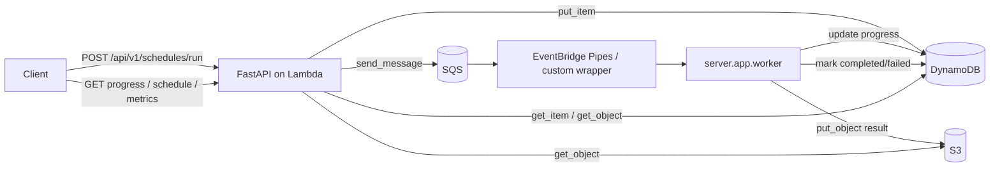

# Kiến Trúc Triển Khai

Tài liệu này mô tả kiến trúc hiện tại của NSGA2IS-SLS trong repository: API Lambda chỉ tiếp nhận request và điều phối job, còn worker là process event-driven chạy riêng để thực thi NSGA-II.

## 1. Mô hình tổng thể

Hệ thống đi theo mô hình bất đồng bộ để tách request HTTP khỏi phần tối ưu nặng:

- FastAPI nhận request và trả `request_id` ngay.
- SQS làm hàng đợi trung gian giữa API và worker.
- Worker nhận 1 payload job cho mỗi lần chạy; trong repo, cách khởi chạy chuẩn là Fargate + EventBridge Pipes.
- DynamoDB giữ trạng thái job và tiến độ.
- S3 lưu kết quả hoàn chỉnh của từng job.

## 2. Thành phần chính

- `server/app/main.py`: FastAPI app, CORS, health check, Mangum handler.
- `server/app/api/`: router HTTP.
- `server/app/application/`: use case và service làm việc với AWS.
- `server/app/domain/`: DTO và logic tối ưu lịch.
- `server/app/worker.py`: entrypoint worker event-driven cho Fargate và wrapper tùy biến.
- `server/nsga2_improved/`: engine NSGA-II nội bộ.
- `serverless.yml`: khai báo Lambda, SQS, DynamoDB, S3 và IAM.

## 3. Luồng thực thi

1. Client gọi `POST /api/v1/schedules/run`.
2. API validate payload, ghi item job vào DynamoDB và đẩy message vào SQS.
3. Orchestrator bên ngoài tạo worker process và truyền payload vào `server.app.worker`.
4. Worker chuyển job sang `RUNNING`, chạy tối ưu và cập nhật progress theo chu kỳ `APP_PROGRESS_UPDATE_INTERVAL`.
5. Khi xong, worker ghi JSON kết quả vào S3 và cập nhật DynamoDB sang `COMPLETED`.
6. API đọc DynamoDB/S3 để phục vụ `progress`, `schedule`, và `metrics`.

## 4. Runtime và cấu hình

- Runtime API: AWS Lambda `python3.12`.
- Base path hiện tại: `ROOT_PATH=/dev`.
- Worker entrypoint: `python -m server.app.worker`.
- Kết quả S3 được lưu dưới key `results/{request_id}.json`.
- Runtime import chạy từ package root `NSGA2IS-SLS`, nên `PYTHONPATH` ở Lambda, worker, và các wrapper phải trỏ về thư mục này để import `server.app.*` đúng cách.
- Worker có thể nhận payload qua `--event`, `--payload`, hoặc biến môi trường `WORKER_EVENT_JSON`/`REQUEST_ID` nếu được bọc bởi orchestrator.

## 5. Giới Hạn Hiện Tại

- API chưa có authentication/authorization.
- DynamoDB và S3 chưa có TTL hoặc lifecycle policy tự động cho dữ liệu job đã xong.
- Worker cập nhật progress theo chu kỳ `APP_PROGRESS_UPDATE_INTERVAL`, không ghi ở mọi thế hệ.
- Nếu chạy worker trực tiếp mà không truyền payload job, process sẽ không có dữ liệu để xử lý.

## 6. Điểm cần nhớ

- API không chạy thuật toán trực tiếp.
- `schedule` và `metrics` chỉ trả khi job đã `COMPLETED`.
- `progress` chỉ phản ánh trạng thái job, không trả full result.
- `APP_PROGRESS_UPDATE_INTERVAL` giúp giảm số lần cập nhật DynamoDB khi worker chạy lâu.
- Hệ thống public chỉ dùng các trạng thái `queued`, `running`, `completed`, `failed`.

## 7. Tài liệu liên quan

- [README.md](README.md)
- [API.md](API.md)
- [deploy/ecs-fargate/README.md](deploy/ecs-fargate/README.md)
- [serverless.yml](serverless.yml)
