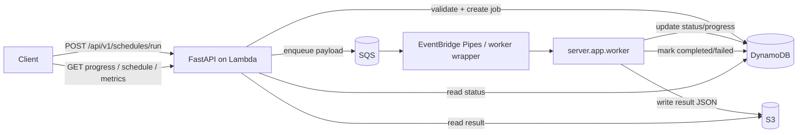

# Kiến Trúc Hệ Thống

Tài liệu này mô tả kiến trúc triển khai của NSGA2IS-SLS theo góc nhìn hệ thống: thành phần nào làm gì, dữ liệu đi qua đâu, và một request sinh lịch được xử lý như thế nào từ lúc nhận vào đến khi trả kết quả cuối cùng.

## 1. Mục tiêu kiến trúc

Hệ thống được thiết kế theo mô hình bất đồng bộ để tách hoàn toàn lớp giao tiếp HTTP khỏi lớp tính toán tối ưu nặng:

- API chỉ chịu trách nhiệm nhận request, xác thực dữ liệu đầu vào, tạo job và trả về `request_id` nhanh.
- Worker chạy riêng như một tiến trình event-driven, chỉ tập trung vào thực thi NSGA-II và ghi kết quả.
- Trạng thái job được lưu bền vững để client có thể theo dõi tiến độ mà không cần giữ kết nối.
- Kết quả đầy đủ được tách khỏi metadata trạng thái để tối ưu cho cả truy vấn ngắn và dữ liệu lớn.

## 2. Bức tranh tổng thể

Kiến trúc của repository xoay quanh 5 lớp chính:

1. **Lớp giao diện HTTP**: FastAPI tiếp nhận request và cung cấp các endpoint cho submit job, kiểm tra tiến độ và đọc kết quả.
2. **Lớp ứng dụng**: use case và service điều phối logic nghiệp vụ, chuyển request thành job và làm việc với AWS.
3. **Lớp domain**: schema, DTO và quy tắc nghiệp vụ của bài toán sinh lịch.
4. **Lớp tối ưu**: engine NSGA-II cải tiến thực thi thuật toán và sinh các phương án lịch.
5. **Lớp hạ tầng**: Lambda, SQS, DynamoDB, S3 và worker runtime triển khai trên AWS.

Tư duy xuyên suốt của kiến trúc là “submit nhanh, xử lý sau, đọc trạng thái ở bất kỳ thời điểm nào”. Điều này giúp API không bị khóa bởi thời gian chạy của thuật toán tối ưu.

## 3. Thành phần chính

- `server/app/main.py`: khởi tạo FastAPI, CORS, health check và Mangum handler cho Lambda.
- `server/app/core/`: giữ cấu hình ứng dụng và các helper cấp nền tảng dùng chung.
- `server/app/api/`: định nghĩa router HTTP và phân tách nhóm endpoint theo chức năng.
- `server/app/application/`: chứa use case và service điều phối nghiệp vụ.
- `server/app/domain/`: định nghĩa schema input/output và logic nghiệp vụ liên quan đến bài toán sinh lịch.
- `server/app/infrastructure/`: chứa adapter AWS cho DynamoDB, S3 và SQS.
- `server/app/worker.py`: entrypoint của worker event-driven, nhận payload job và chạy tối ưu.
- `server/nsga2_improved/`: phần lõi thuật toán NSGA-II cải tiến, bao gồm core, operators, selection và algorithm.
- `serverless.yml`: mô tả hạ tầng Lambda, SQS, DynamoDB, S3, IAM và các biến môi trường cho runtime.
- `deploy/ecs-fargate/`: tài liệu và manifest triển khai worker trên ECS Fargate.

## 4. Luồng dữ liệu đầu vào

### 4.1 Request từ client

Request chính đi vào hệ thống qua `POST /api/v1/schedules/run`. Payload thường mang các tham số đầu vào của bài toán lập lịch, chẳng hạn:

- danh sách bác sĩ hoặc nguồn lực cần phân ca,
- số ca mỗi ngày,
- ràng buộc nghiệp vụ,
- tham số tối ưu hóa,
- cấu hình ngẫu nhiên và số thế hệ.

API sẽ thực hiện các bước sau:

1. Parse JSON body.
2. Validate dữ liệu theo schema của domain.
3. Chuẩn hóa payload thành cấu trúc nội bộ.
4. Sinh `request_id` để định danh job.
5. Ghi metadata ban đầu vào DynamoDB với trạng thái `queued`.
6. Đẩy payload vào SQS để worker xử lý bất đồng bộ.
7. Trả phản hồi `202 Accepted` kèm `request_id`.

### 4.2 Dữ liệu khi vào worker

Worker nhận payload từ orchestrator bên ngoài. Trong repo, worker có thể được khởi chạy bằng `python -m server.app.worker` và nhận đầu vào qua một trong các kênh sau:

- tham số dòng lệnh `--event` hoặc `--payload`,
- biến môi trường `WORKER_EVENT_JSON`,
- biến môi trường `REQUEST_ID` nếu orchestrator đã giữ payload ở nguồn khác.

Payload tối thiểu phải đủ để xác định job cần chạy và các tham số thuật toán cần thiết. Worker sau đó đọc metadata job, đánh dấu `running` và bắt đầu quá trình tối ưu.

## 5. Luồng xử lý end-to-end

### 5.1 Tạo job

1. Client gọi API sinh lịch.
2. API kiểm tra tính hợp lệ của đầu vào.
3. API tạo bản ghi job trong DynamoDB.
4. API gửi message vào SQS để tách xử lý nặng ra khỏi request HTTP.

### 5.2 Thực thi tối ưu

1. Orchestrator đọc message từ SQS và khởi chạy worker.
2. Worker lấy payload tương ứng với job.
3. Worker chuyển trạng thái job sang `running`.
4. Worker chạy NSGA-II cải tiến trong `server/nsga2_improved/`.
5. Theo chu kỳ cấu hình bởi `APP_PROGRESS_UPDATE_INTERVAL`, worker cập nhật tiến độ vào DynamoDB.
6. Worker sinh dữ liệu lịch và metrics sau khi hoàn tất vòng tối ưu.

### 5.3 Ghi kết quả

1. Worker serialize kết quả cuối cùng thành JSON.
2. Worker ghi JSON đó vào S3 dưới key theo `request_id`.
3. Worker cập nhật DynamoDB sang `completed` hoặc `failed` tùy kết quả chạy.
4. API đọc metadata từ DynamoDB và đọc nội dung kết quả từ S3 khi client gọi các endpoint truy vấn.

## 6. Trạng thái dữ liệu trong hệ thống

Dữ liệu job đi qua các trạng thái chuẩn sau:

- `queued`: job đã được tạo và chờ worker xử lý.
- `running`: worker đang thực thi tối ưu.
- `completed`: job hoàn tất và đã có kết quả.
- `failed`: worker dừng do lỗi hoặc payload không thể xử lý.

Thông tin job trong DynamoDB thường bao gồm:

- `request_id`,
- trạng thái hiện tại,
- tiến độ phần trăm hoặc chỉ số thế hệ,
- timestamp tạo và cập nhật,
- thông tin lỗi nếu có,
- con trỏ đến object kết quả trên S3.

Kết quả đầy đủ nằm trong S3 để tránh phình lớn bản ghi trạng thái ở DynamoDB. Cách tổ chức này giúp đọc progress nhanh nhưng vẫn giữ được dữ liệu đầu ra chi tiết khi cần.

## 7. Các lớp runtime và cấu hình

- **API runtime**: AWS Lambda với Python 3.12 thông qua Mangum.
- **Worker runtime**: process Python độc lập, phù hợp với ECS Fargate hoặc wrapper event-driven tùy cách triển khai.
- **Base path hiện tại**: `/dev` trong môi trường deploy hiện tại.
- **Package root**: code vẫn nằm dưới `NSGA2IS-SLS`, nhưng bootstrap, Docker và Lambda runtime đã được cấu hình để chấp nhận cả `NSGA2IS-SLS` lẫn repo root khi cần.
- **S3 output key**: kết quả cuối cùng được lưu theo pattern `results/{request_id}.json`.

### Biến môi trường chính

Các biến runtime cốt lõi của luồng async gồm:

- `QUEUE_URL`
- `TABLE_NAME`
- `BUCKET_NAME`
- `AWS_REGION`

Worker và bootstrap script có thể dùng thêm:

- `WORKER_EVENT_JSON`
- `REQUEST_ID`
- `WORKER_MAX_RUNTIME_SECONDS`
- `LOG_LEVEL`

Các biến `APP_*` điều khiển hành vi tối ưu và được đọc bởi `server/app/core/settings.py`, đặc biệt là:

- số lượng cá thể ban đầu,
- số thế hệ,
- số phương án Pareto cần giữ,
- chu kỳ cập nhật progress,
- mức độ randomization,
- random seed.

## 8. Kiến trúc triển khai AWS

### 8.1 API layer

FastAPI được đóng gói để chạy trên Lambda. Lambda chỉ giữ vai trò gateway cho request/response, không thực thi thuật toán tối ưu trực tiếp.

### 8.2 Queue layer

SQS là điểm tách giữa API và worker. Lợi ích của tầng này là:

- giảm coupling giữa HTTP và tính toán dài,
- cho phép retry theo cơ chế queue,
- chống nghẽn khi có nhiều request đồng thời.

### 8.3 Worker layer

Worker đọc job từ payload, cập nhật trạng thái, chạy thuật toán và ghi kết quả. Trong repository, worker chuẩn được thiết kế để chạy cùng mô hình Fargate + EventBridge Pipes, nhưng entrypoint vẫn đủ linh hoạt để bọc bởi orchestrator khác nếu cần.

### 8.4 Data layer

- **DynamoDB**: lưu trạng thái job, tiến độ và metadata điều phối.
- **S3**: lưu kết quả hoàn chỉnh của job dưới dạng JSON.

## 9. Luồng đọc dữ liệu từ API

Sau khi job được tạo, các endpoint truy vấn hoạt động như sau:

- `GET /api/v1/schedules/progress/{request_id}`: đọc metadata từ DynamoDB để trả trạng thái hiện tại.
- `GET /api/v1/schedules/jobs/{request_id}/schedule`: nếu job đã hoàn tất, API đọc file kết quả từ S3 và trả phần lịch.
- `GET /api/v1/schedules/jobs/{request_id}/metrics`: nếu job đã hoàn tất, API đọc file kết quả từ S3 và trả metrics liên quan.

Mô hình này giúp tách rõ dữ liệu “nhẹ” cần truy vấn thường xuyên khỏi dữ liệu “nặng” chỉ cần đọc khi job đã xong.

## 10. Quan hệ giữa các thư mục mã nguồn

- `server/app/api/` định tuyến request vào application layer.
- `server/app/application/` điều phối use case.
- `server/app/core/` giữ settings và helper nền.
- `server/app/domain/` giữ schema và logic nghiệp vụ cốt lõi.
- `server/app/infrastructure/` giữ các adapter AWS.
- `server/nsga2_improved/` chứa engine tối ưu thực sự.
- `deploy/ecs-fargate/` mô tả cách ghép worker vào hạ tầng chạy nền.

## 11. Tài liệu liên quan

- [README.md](README.md)
- [API.md](API.md)
- [deploy/ecs-fargate/README.md](deploy/ecs-fargate/README.md)
- [serverless.yml](serverless.yml)
